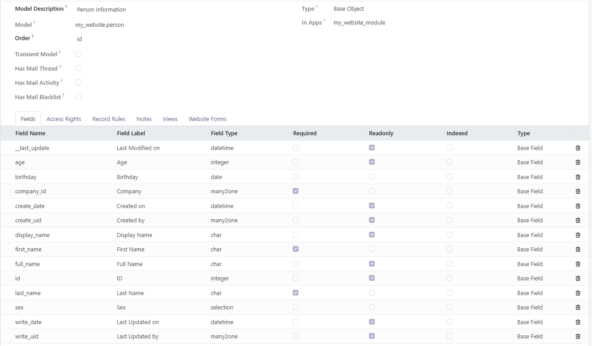
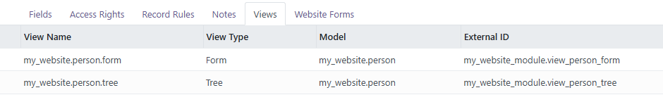
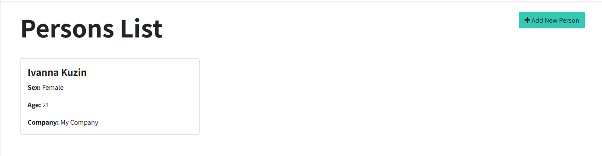
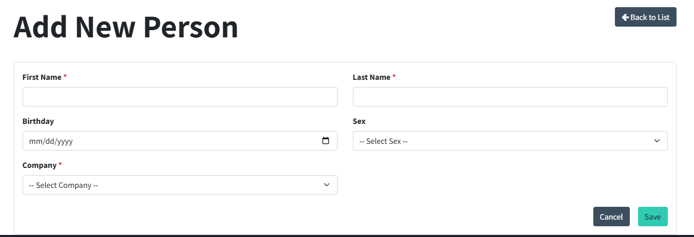

===================
My Website Persons
===================

The **My Website Module** is a custom Odoo add-on that extends the functionality of the website module. It introduces new features and enhancements to improve website management and user experience.

Key Features
========
- **Feature 1**: Created a model for persons to the website module with list and form views.

- **Feature 2**: Implemented a controller to handle the display of persons on the website.

- **Feature 3**: Developed a template to create a new person.

Dependencies
========
This module depends on the Website module in Odoo.